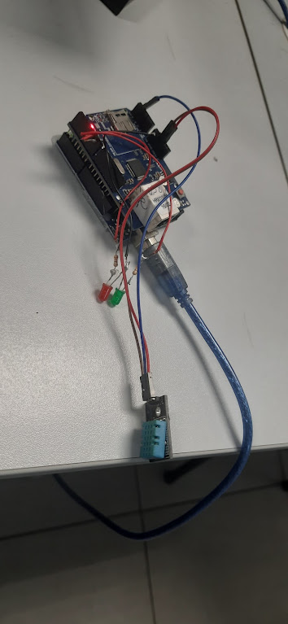

# python_mqtt_zabbix
Script Python para coleta de dados via Protocolo MQTT + Zabbix.


O script foi desenvolvido através da necessidade de monitorar as métricas de temperatura de uma sala de servidores, utilizando um Arduino como dispositivo de coleta de dados.





#Depêndencias

Broker configurado no seu sensor IoT.

**biblioteca paho.mqtt.client**

#Instalação:
````
pip install paho-mqtt

pip show paho-mqtt
````
````
Name: paho-mqtt
Version: 2.1.0
Summary: MQTT version 5.0/3.1.1 client class
Home-page:
Author:
Author-email: Roger Light <roger@atchoo.org>
License: EPL-2.0 OR BSD-3-Clause
Location: /usr/local/lib/python3.9/site-packages
Requires:
Required-by:

````
### MQTT.py
```
import paho.mqtt.client as mqtt

# Configurações do Broker MQTT
BROKER_IP = 'IP_SENSOR'  # Substitua pelo IP do seu broker MQTT
BROKER_PORT = 1883            # Porta padrão do MQTT
TOPIC = 'devices/nome_sensor/sensor/temperature' # Substitua pelo tópico que você está monitorando

# Função chamada quando uma mensagem é recebida
def on_message(client, userdata, message):
    payload = message.payload.decode()
    print(f"Recebido valor do sensor de temperatura: {payload}")

# Configuração do cliente MQTT
client = mqtt.Client()

# Definindo a função de callback
client.on_message = on_message

try:
    # Conectar ao broker
    print(f"Conectando ao broker MQTT em {BROKER_IP}:{BROKER_PORT}...")
    client.connect(BROKER_IP, BROKER_PORT, 60)

    # Inscrever-se no tópico
    print(f"Inscrevendo-se no tópico '{TOPIC}'...")
    client.subscribe(TOPIC)

    # Manter a conexão e aguardar mensagens
    print("Aguardando mensagens...")
    client.loop_forever()

except KeyboardInterrupt:
    # Encerrar a conexão em caso de interrupção (Ctrl+C)
    print("Interrompido pelo usuário. Desconectando...")
    client.disconnect()

except Exception as e:
    # Captura e exibe qualquer erro
    print(f"Erro: {e}")

```


Local do Script MQTT.py: ***/lib/zabbix/externalscripts***

Item Zabbix:


